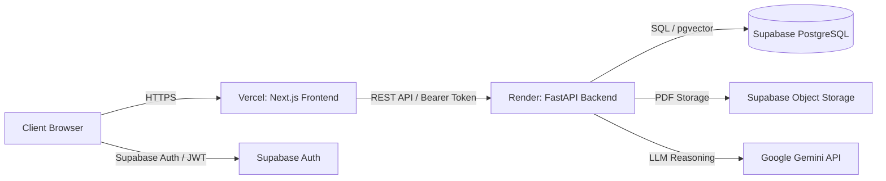

# Deployment Guide: Vercel (Frontend) & Render (Backend)

This guide provides instructions for deploying the **Money Docs Decoded** application to **Render** (FastAPI backend) and **Vercel** (Next.js frontend), backed by **Supabase** (Postgres + pgvector + Auth + Object Storage).

---

## Architecture Overview



---

## Part 1: Deploy Backend on Render

### Method A: 1-Click Render Blueprint (Recommended)
1. Push this repository to your GitHub account.
2. Log in to your [Render Dashboard](https://dashboard.render.com).
3. Click **New +** → **Blueprint**.
4. Select your `money-docs-decoded` repository.
5. Render will detect [`render.yaml`](./render.yaml) automatically.
6. Populate the secret environment variables when prompted:
   - `SUPABASE_URL`
   - `SUPABASE_SERVICE_ROLE_KEY`
   - `SUPABASE_ANON_KEY`
   - `GEMINI_API_KEY`
7. Click **Apply**. Render will build the Docker container and start your FastAPI service.

---

### Method B: Manual Docker Web Service
If you prefer creating the Web Service manually:
1. In Render Dashboard, click **New +** → **Web Service**.
2. Connect your Git repository.
3. Configure the service settings:
   - **Name**: `money-docs-decoded-api`
   - **Language**: `Docker`
   - **Docker Context**: `./backend`
   - **Dockerfile Path**: `./backend/Dockerfile`
   - **Region**: Closest to you (e.g., `Oregon`, `Frankfurt`, or `Singapore`)
   - **Instance Type**: `Free` or `Starter`
   - **Health Check Path**: `/health`
4. Add the following **Environment Variables** in Render:

| Key | Example Value | Description |
|---|---|---|
| `PORT` | `8000` | Port automatically set by Render |
| `ALLOWED_ORIGINS` | `http://localhost:3000` | Additional origins; `*.vercel.app` is allowed automatically |
| `GEMINI_API_KEY` | `AIzaSy...` | Your Google Gemini API key |
| `GEMINI_MODEL` | `gemini-1.5-flash` | Gemini model name |
| `SUPABASE_URL` | `https://your-ref.supabase.co` | Your Supabase project URL |
| `SUPABASE_SERVICE_ROLE_KEY` | `eyJhbGci...` | Supabase Service Role Secret Key (for backend DB access) |
| `SUPABASE_ANON_KEY` | `eyJhbGci...` | Supabase Anon Public Key |
| `DEMO_MODE` | `false` | Disables mock fallback; enforces live Supabase data |

5. Click **Create Web Service**.
6. Once deployed, note your service URL (e.g. `https://money-docs-decoded-api.onrender.com`).
7. Test your deployment:
   ```bash
   curl https://money-docs-decoded-api.onrender.com/health
   # Expected response: {"status":"healthy","service":"Money Docs Decoded Backend API","version":"1.0.0"}
   ```

---

## Part 2: Deploy Frontend on Vercel

1. Log in to your [Vercel Dashboard](https://vercel.com).
2. Click **Add New...** → **Project**.
3. Import your `money-docs-decoded` repository.
4. Under **Project Configuration**:
   - **Framework Preset**: `Next.js`
   - **Root Directory**: Click **Edit** and choose `frontend` (Or leave root if using root `vercel.json`)
   - **Build Command**: `next build` (default)
   - **Output Directory**: `.next` (default)
5. Expand **Environment Variables** and add the following:

| Key | Value | Description |
|---|---|---|
| `NEXT_PUBLIC_API_BASE_URL` | `https://money-docs-decoded-api.onrender.com` | Your Render backend URL (no trailing slash) |
| `NEXT_PUBLIC_SUPABASE_URL` | `https://your-ref.supabase.co` | Your Supabase Project URL |
| `NEXT_PUBLIC_SUPABASE_ANON_KEY` | `eyJhbGci...` | Your Supabase Anon Key (Public) |

6. Click **Deploy**.
7. Vercel will build the frontend and provide your production URL (e.g. `https://money-docs-decoded.vercel.app`).

---

## Part 3: Cross-Origin & Security Verification

1. **CORS Support**:
   - The backend includes an origin regex (`allow_origin_regex=r"https://.*\.vercel\.app"`), ensuring all Vercel branch preview URLs and production URLs can send requests without manual origin configuration.
   - If using a custom domain on Vercel (e.g. `https://app.moneydocs.com`), add it to `ALLOWED_ORIGINS` in Render:
     ```
     ALLOWED_ORIGINS=http://localhost:3000,https://app.moneydocs.com
     ```

2. **Render Cold Starts (Free Tier)**:
   - On the Render Free tier, instances spin down after 15 minutes of inactivity. The first request after sleep may take ~30–50 seconds.
   - The frontend's new **Intermediate Processing State** automatically polls every 2 seconds, gracefully handling background tasks and cold starts without throwing errors or displaying default values.
   - For continuous uptime during demos/judging, you can set up a free 5-minute health check monitor (e.g. using [UptimeRobot](https://uptimerobot.com) targeting `https://money-docs-decoded-api.onrender.com/health`).

3. **Pre-cached Embeddings**:
   - The [`backend/Dockerfile`](./backend/Dockerfile) pre-caches `sentence-transformers/all-MiniLM-L6-v2` during container build, ensuring that startup takes < 1 second and requires no runtime downloads.

4. **File Upload Limit**:
   - Ingestion supports PDF/image files up to 25 MB with validation against corrupted headers.
