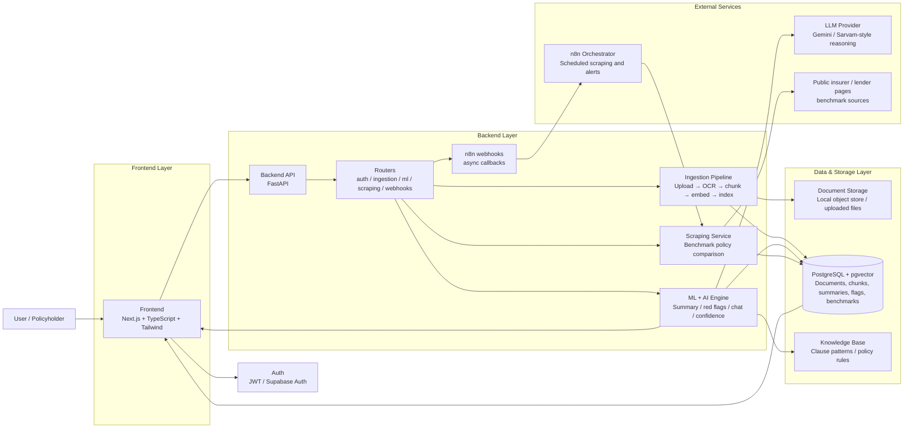

# Money Docs Decoded — System Overview

**Goal of this doc set:** Each component below has its own detailed `.md` file. 
## Components (one file each)

| File | Component | One-line role |
|---|---|---|
| `01-frontend.md` | Frontend | Every page/screen, its purpose, data it needs, and states it must handle |
| `02-backend.md` | Backend / API | All services, endpoints, workflows, and how components talk to each other |
| `03-ml-ai-engine.md` | ML / AI Engine | Document understanding, red-flag detection, Q&A, confidence scoring |
| `04-web-scraping-intelligence.md` | Web Scraping & Competitive Intelligence | The new feature — scraping insurer/lender policy pages to catch hidden clauses and benchmark |
| `05-database-schema.md` | Data Layer | What gets stored, where, and why (Postgres + vector store + object storage) |
| `06-n8n-automation-workflows.md` | n8n Orchestration | Which workflows live in n8n vs. in your own backend, and why |
| `07-infra-deployment-security.md` | Infra, Deployment & Security | Hosting, secrets, compliance (DPDP Act), auth, observability |

## How the pieces fit together (high level)

```
User (web app)
   │
   ▼
Frontend (Next.js/React) ──────────────► Auth (Clerk/Supabase Auth)
   │
   ▼
Backend API (FastAPI/Node)
   │
   ├──► Ingestion pipeline (OCR → chunking → embeddings)         [03-ml]
   ├──► Red-Flag Knowledge Base (vector DB + rules)               [03-ml, 05-db]
   ├──► LLM Reasoning Engine (Gemini API)                         [03-ml]
   ├──► Web Scraper service (policy/company benchmark data)       [04-scraping]
   ├──► n8n webhooks (async jobs: scraping refresh, alerts, OCR)  [06-n8n]
   └──► Postgres + pgvector + S3-compatible object storage        [05-db]
```

## Mermaid architecture diagram



## Build order recommendation
1. Collect and label a red-flag clause dataset (see `03-ml-ai-engine.md` for sourcing and labeling approach).
2. Fine-tune a clause-classification model on that dataset (see `03-ml-ai-engine.md` for model choice and fine-tuning approach) and evaluate it against a held-out set.
3. Build the rule-based detector in parallel as a fallback/complement — the fine-tuned model and the rules do not have to be either/or.
4. Build backend skeleton + doc upload + OCR/text extraction + basic plain-language summary (single LLM call).
5. Wire the fine-tuned model into the red-flag detection pipeline, with citations back to page/clause.
6. Conversational Q&A over the uploaded doc (RAG with embeddings).
7. Web scraping module — start with 3–5 hardcoded insurer/lender policy pages, not a general crawler.
8. Confidence score, now informed by the fine-tuned model's outputs rather than a rules-only formula (still keep the breakdown transparent — see `03-ml-ai-engine.md`).
9. n8n workflows for anything async (re-scraping, notification, retraining triggers).

## Cross-cutting decisions to lock in now

- **LLM provider:** Gemini API (free tier) for reasoning/summarization/Q&A.Keep the LLM call wrapped behind a single internal interface in the backend (e.g., a `generate(prompt, ...)` function) so switching providers later — or falling back to a second provider if you hit free-tier limits — doesn't require touching every call site.
- **Vector store:** pgvector inside Postgres (Supabase) instead of a separate vector DB.
- **Languages supported at launch:** English + Hindi only (as pitched).
- **Document types at launch:** Health insurance policy PDF only. Loan agreements and mutual fund factsheets are stretch goals — the architecture should support them, but don't build all three ingestion paths before one works end-to-end.
- **Legal/compliance framing:** Every output must include a disclaimer that this is not financial or legal advice, and confidence scores/red flags are informational. This matters both for judges and for real-world liability.